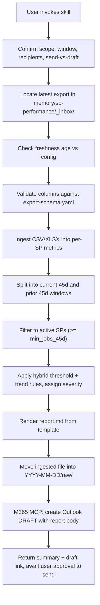

# VIXXO SP Performance Monitor (VixxoLens, v1 file-ingest)

**Linear:** parent story [AIA-403](https://linear.app/vixxo/issue/AIA-403), epic [AIA-376](https://linear.app/vixxo/issue/AIA-376).
**v1 scope:** ingests a manual CSV/XLSX export dropped into `memory/sp-performance/_inbox/`. No live VixxoLens access.
**v2 (deferred):** [AIA-486](https://linear.app/vixxo/issue/AIA-486) — automate the VixxoLens / Power BI pull. Only the `locate` and `ingest` steps change; everything downstream stays the same.
**KPI source of truth:** `references/sp-playbook-kpis.md` (current SP performance goals). Targets in `config/thresholds.yaml` are authoritative for this skill — they are not placeholders.

## When to use

Use this skill when the user asks to:

- identify service providers trending toward failure over the last 45 days
- generate an SP performance health check from a VixxoLens export
- draft the weekly/ad-hoc "at-risk SPs" email
- review SLA Compliance / First-Time Fix / Recall Rate / Quote Turnaround Time / VixxoLink Adoption / Invoice Rejection degradation
- check the work-orders-completed **+/-** trend per SP (drops = possible disengagement; spikes = capacity pressure)

Do **not** use this skill for:

- single-SP deep dives (read the raw VixxoLens report instead)
- customer-facing performance summaries (different audience and framing)
- sending the email (send is always a separate, explicit user action)

## KPIs scored (SP Playbook)

Sourced from `references/sp-playbook-kpis.md`. Targets are absolute thresholds from the playbook; trend deltas live in `config/thresholds.yaml`.

| KPI | Target | Direction of breach |
|---|---|---|
| SLA Compliance Rate | ≥ 85% | below |
| First-Time Fix Rate | ≥ 90% | below |
| Recall Rate (30-day lookback) | ≤ 5% | above |
| Quote Turnaround Time (P0/P1) | ≤ 24 hours / 1 day | above |
| VixxoLink Adoption Rate | ≥ 70% | below |
| Invoice Rejection Rate | ≤ 2% | above |

Plus a symmetric **Work-Orders-Completed +/-** trend signal (drops flag possible disengagement; spikes flag capacity pressure). Drops alone yield `watch`; they only escalate when paired with a KPI threshold breach.

## Output format

Return results in this order:

1. **Run summary** — source export filename, ingest timestamp, window dates, counts by severity, top 3 critical SPs.
2. **Artifacts written** — paths to `metrics.json`, `report.md`, and the Outlook draft preview.
3. **Outlook draft link** — draft `id` / web link returned by the M365 MCP.
4. **Completion trend (+/-)** — count of SPs tripping the drop flag and the spike flag, plus top declines/increases if notable.
5. **Calibration gaps** — any threshold or recipient still at `<TBD>` that blocked a cleaner run.
6. **Next action** — "review draft, edit if needed, then send" (never auto-send).

## Inputs and outputs on disk

```
memory/sp-performance/
  _inbox/                                   # user drops the export here
    vixxolens-export-<YYYY-MM-DD>.csv|xlsx
  _samples/                                 # reference exports (schema-conformant)
  <YYYY-MM-DD>/
    raw/                                    # ingested file(s) moved here for audit
    metrics.json                            # normalized per-SP metrics, both windows
    report.md                               # human-readable findings
    email-draft.eml-preview.md              # body handed to the M365 draft tool
```

## Workflow



1. **Confirm scope.** Ask the user once: current window end date (default = today), recipient list to use (default = `config/recipients.yaml`), and confirm "draft only, do not send". If any config value is `<TBD>`, surface it here and let the user either provide it inline or accept a conservative default.
2. **Locate the export.** Scan `memory/sp-performance/_inbox/` for `*.csv` / `*.xlsx`. If multiple files exist, pick the newest by filename date (fall back to mtime) and surface the choice to the user.
3. **Freshness check.** If the newest file is older than `freshness_window_days` (default 7), stop and ask the user to produce a fresh export. Do not silently run on stale data.
4. **Validate schema.** Compare the file's columns against `config/export-schema.yaml`. On mismatch, **stop** and return a precise diff — missing columns, extra columns, type mismatches. Never silently mis-map KPIs. The fix is an `export-schema.yaml` edit, not a code change.
5. **Ingest.** Parse CSV/XLSX into a flat table keyed by `sp_id` (or `sp_name` when no stable ID is present). Preserve row provenance (source filename, row number).
6. **Window split.** If the export contains a `period_label` of `current_45d` / `prior_45d`, use it directly. Otherwise compute the split from `period_start` / `period_end` against today's date.
7. **Active-SP filter.** Drop SPs whose `jobs_count` in the current 45-day window is below `min_jobs_45d` (default 10). Log the count dropped.
8. **Top-customer context.** For each scored SP, calculate the customer with the highest current-window job volume from the raw customer column (`customer_name` when available, otherwise `customer_number` / customer ID). Store both `top_customer_current` and `top_customer_current_jobs` in `metrics.json`. Do **not** show stale owner names in distribution reports; use this top-customer context instead.
9. **Score with hybrid detection.** For each remaining SP and each playbook KPI (SLA Compliance, First-Time Fix, Recall Rate, Quote Turnaround Time for P0/P1, VixxoLink Adoption, Invoice Rejection) plus the work-orders-completed trend:
   - **Threshold breach** if the absolute value crosses the playbook bound (`config/thresholds.yaml`). Direction follows `higher_is_worse` in `config/export-schema.yaml`.
   - **Trend degradation** if the current 45d worsens vs prior 45d by at least the configured percent delta.
   - **Quote Turnaround Time** is scored only for P0 and P1 quote activity. If the export aggregates all priorities together and cannot isolate P0/P1, surface that as a schema/calibration gap instead of silently scoring the wrong population.
   - **Work-orders-completed trend (+/-)** — symmetric, always reported:
     - Compute current-45d count, prior-45d count, absolute delta, percent delta.
     - `drop` flag fires if pct delta ≤ −`wo_completed_drop_pct` (default 30%) and prior ≥ `min_jobs_45d`.
     - `spike` flag fires if pct delta ≥ +`wo_completed_spike_pct` (default 50%) and prior ≥ `min_jobs_45d`.
     - A `drop` alone = `watch`; it only escalates to `warning`/`critical` when combined with a threshold breach. A `spike` is always informational — it never escalates severity on its own.
   - Assign severity:
     - `critical` — threshold breached **and** trend degraded on the same KPI
     - `warning` — threshold breached **or** trend degraded ≥ 1.5× the configured delta
     - `watch` — trend degraded at exactly the configured delta, no threshold breach
10. **Render report.** Fill `templates/sp-performance-report.md` with the computed findings. Per-SP context must show top customer by current-window volume, not owner / SPM, because ownership in the raw exports can be stale. Stamp the source export filename and ingest timestamp into the methodology footer.
11. **Archive.** Move the ingested file(s) from `_inbox/` to `memory/sp-performance/<YYYY-MM-DD>/raw/` only after the report renders without error.
12. **Draft the email.** Call the Microsoft 365 MCP `create-draft-message` tool. Body = `templates/email-draft.md` with the report inlined (HTML preferred for Outlook rendering). Recipients resolved from `config/recipients.yaml` via the M365 directory — never invent addresses.
13. **Hand off.** Return the run summary, the draft link, and the list of critical SPs. **Do not send.** Sending is a separate, explicit user action per the outbound-messaging guardrail.

## Guardrails

- **Draft-only delivery.** Per `.cursor/rules/outbound-messaging-guardrail.mdc` and `AGENTS.md`, every outbound surface is draft-then-approve. This skill creates a draft; it never sends.
- **No invented recipients.** Addresses come from `config/recipients.yaml` and are resolved through the M365 directory tool. Do not synthesize SMTP addresses from names.
- **Schema-validation refusal.** On column mismatch, stop and return the diff. Silent mis-mapping is a correctness hazard.
- **Freshness refusal.** If the newest export is older than `freshness_window_days`, stop and ask for a fresh pull instead of reporting stale data.
- **Calibration gate.** If `thresholds.yaml` still contains `<TBD>` values for KPIs, downgrade affected severities to `watch` and surface the gap in the run summary. Never fabricate threshold values.
- **Memory vault.** Per `.cursor/rules/memory-vault-protection.mdc`, never delete files under `memory/`. Archiving is a move, not a delete.

## Microsoft 365 query guidance

- Use `create-draft-message` (or the equivalent Graph draft tool surfaced by `project-0-HABLADORA-microsoft-365`) to produce the Outlook draft.
- Prefer HTML body (`contentType: html`) so the report's tables and severity headings render correctly in Outlook.
- Resolve recipients with the users/directory tool, not by guessing SMTP addresses.
- Do not combine `$search` and `$filter` on a single Graph request. Keep page sizes modest.

## Calibration checklist

The KPI thresholds are playbook/user-goal derived (`references/sp-playbook-kpis.md`)
and live in `config/thresholds.yaml`.
What still needs confirmation per run:

- `config/export-schema.yaml` — confirm column names match the VixxoLens export the user produced. If VixxoLens does not yet expose P0/P1 quote turnaround time, VixxoLink adoption, or invoice rejection rate, the skill surfaces the gap in the run summary. Confirm which customer field should drive top-customer context; prefer customer name, fall back to customer number.
- `config/recipients.yaml` — set the approved distribution list (currently shake-out: Maria only). Expand only when explicitly approved.
- Trend deltas in `config/thresholds.yaml` — tune after each run per [AIA-466](https://linear.app/vixxo/issue/AIA-466).

The skill surfaces missing KPI fields or constrained recipients in the run summary's "Calibration gaps" section rather than fabricating data.

## v2 transition notes ([AIA-486](https://linear.app/vixxo/issue/AIA-486))

v2 replaces the `locate` + `ingest` steps with an automated pull (VixxoLens MCP / Power BI REST + DAX). The `export-schema.yaml` contract is the integration boundary — if v2 targets the same column shape, the rest of this workflow (window split, scoring, report, draft) is unchanged.
